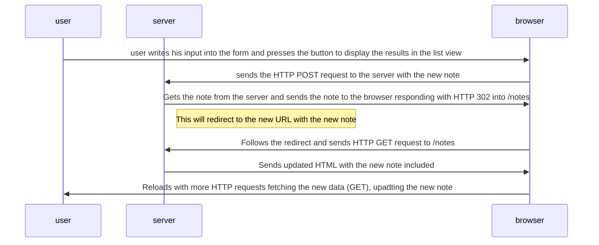
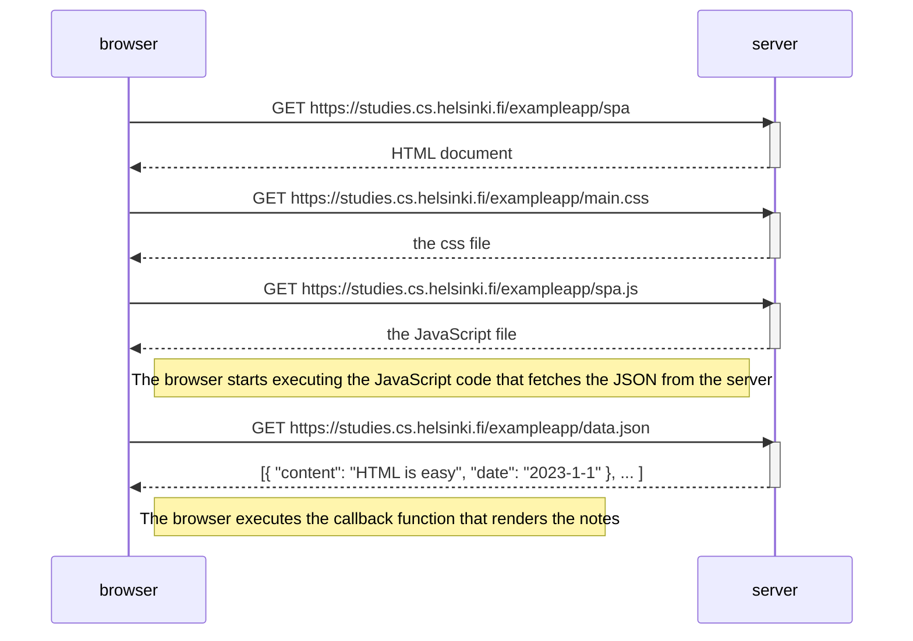
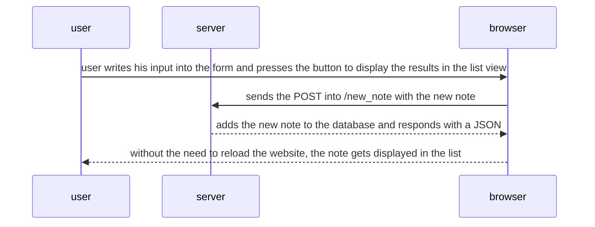

```mermaid
sequenceDiagram
    participant user
    participant server
    participant browser
    user->>browser: user writes his input into the form and presses the button to display the results in the list view
    browser->>server: sends the HTTP POST request to the server with the new note
    server->>browser: Gets the note from the server and sends the note to the browser responding with HTTP 302 into /notes
    Note right of server: This will redirect to the new URL with the new note
    browser->>server: Follows the redirect and sends HTTP GET request to /notes
    server->>browser: Sends updated HTML with the new note included
    browser->>user: Reloads with more HTTP requests fetching the new data (GET), upadting the new note
```

```mermaid
sequenceDiagram
    participant browser
    participant server

    browser->>server: GET https://studies.cs.helsinki.fi/exampleapp/spa
    activate server
    server-->>browser: HTML document
    deactivate server

    browser->>server: GET https://studies.cs.helsinki.fi/exampleapp/main.css
    activate server
    server-->>browser: the css file
    deactivate server

    browser->>server: GET https://studies.cs.helsinki.fi/exampleapp/spa.js
    activate server
    server-->>browser: the JavaScript file
    deactivate server

    Note right of browser: The browser starts executing the JavaScript code that fetches the JSON from the server

    browser->>server: GET https://studies.cs.helsinki.fi/exampleapp/data.json
    activate server
    server-->>browser: [{ "content": "HTML is easy", "date": "2023-1-1" }, ... ]
    deactivate server

    Note right of browser: The browser executes the callback function that renders the notes
```

```mermaid
sequenceDiagram
    participant user
    participant server
    participant browser
    user->>browser: user writes his input into the form and presses the button to display the results in the list view
    browser->>server: sends the POST into /new_note with the new note
    server-->>browser: adds the new note to the database and responds with a JSON
    browser-->>user: without the need to reload the website, the note gets displayed in the list
```